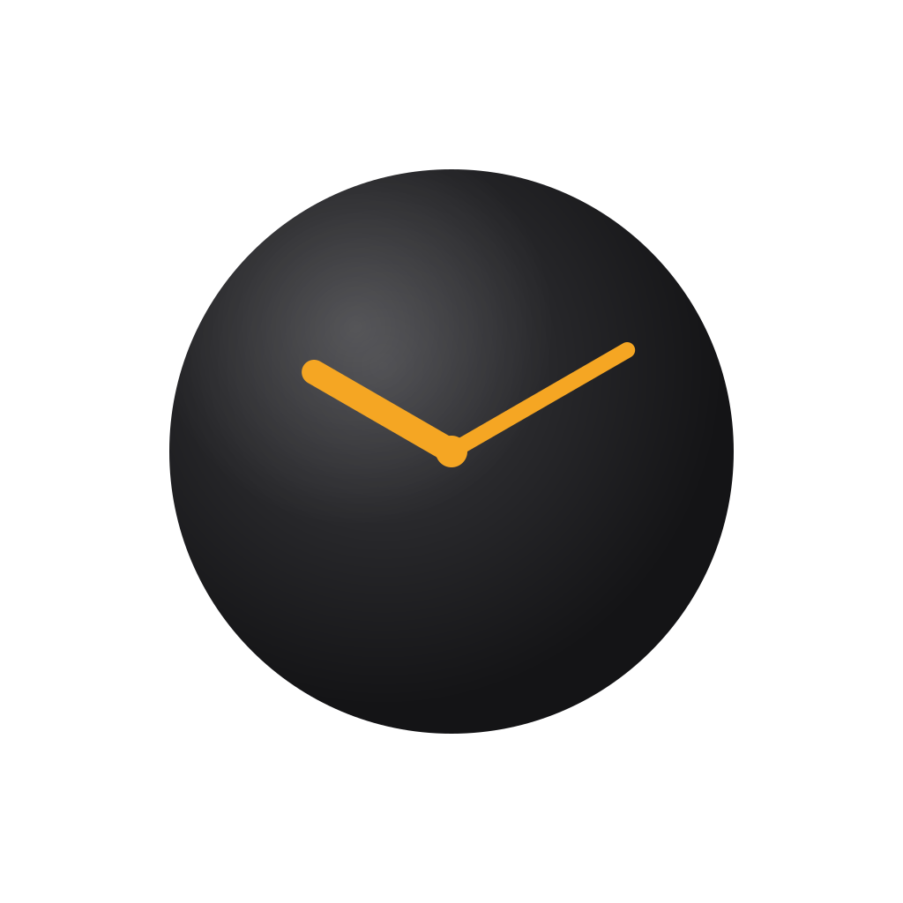

# Go Clock

A mobile Go clock for two players, built with React Native and Expo.

<div align="center">
  
</div>

## Features

- **Four time control systems** — Byoyomi, Canadian, Fischer, and Absolute
- **Tournament presets** — filtered by mode, based on real Go tournament usage (OGS, EGF, AGA)
- **Two-player landscape layout** — each player has their own half of the screen; the Black player's side is rotated 180° so both players can read the clock face-to-face
- **Physical clock display** — time shown as `H:MM` + seconds in smaller font, matching the format of real electronic clocks
- **Haptic feedback** — medium impact on each clock press, escalating vibrations during the last 5 seconds of a Byoyomi period, error notification on timeout
- **Sound alerts** — beeps on the last 10 seconds of a critical period, urgent beeps on the last 5
- **Move counter** — tracks each player's move count throughout the game
- **Pause** — accessible via the center bar; tap the opponent's half also pauses the clock (useful during Canadian stone counting)
- **Resume mode** — configure remaining time per player when taking over from a broken clock, with full overtime support (periods, byoyomi time, Canadian period state)
- **Configurable first player** — toggle between Black and White for handicap games
- **Configurable board side** — choose which physical side of the device Black plays on (left or right)
- **Two display styles** — LED (7-segment DSEG7 font on a light background) or dark app style
- **Persistent settings** — last configuration is restored when you return to setup
- **Screen stays on** — display never sleeps during a game
- **Five languages** — French, English, Korean, Japanese, Chinese

## Time control systems

| System | Description |
|--------|-------------|
| **Byoyomi** | Main time + N periods of X seconds. Playing within a period resets it. Standard in Japanese tournaments. |
| **Canadian** | Main time + Y moves to complete within X minutes. Period resets after all moves are played. |
| **Fischer** | Each move adds an increment to remaining time. |
| **Absolute** | Fixed total time, no overtime — sudden death. |

## Presets

| Mode | Presets |
|------|---------|
| Byoyomi | Blitz (5min+5×30s), Online (10min+5×30s), Club (30min+5×30s), EGF (45min+3×30s), Long (60min+5×60s) |
| Canadian | Rapid (20min+20/5min), Standard (30min+25/10min), Long (45min+30/10min) |
| Fischer | Blitz (5min+5s), Rapid (15min+10s), Standard (30min+15s), Long (60min+30s) |
| Absolute | Blitz (10min), Rapid (20min), Standard (30min), Long (60min) |

## Getting started

```bash
npm install
npm start        # Expo dev server (scan QR code)
npm run android  # Android emulator
```

Requires the [Expo Go](https://expo.dev/go) app on your device, or a configured Android emulator.

## How to play

1. Select a time control or pick a preset on the setup screen
2. Choose which player goes first (Black by default)
3. Tap **Start game**
4. Tap the full-screen overlay to begin — each subsequent tap ends your move and starts the opponent's clock
5. Tap the **opponent's half** to pause; tap anywhere to resume
6. Use the center bar to pause ⏸ or go back ←

## Resume mode

Enable **Resume mode** at the bottom of the setup screen to configure the exact clock state when taking over from a broken or unavailable clock.

For each player, set:
- **Main time remaining** — with an *Épuisé* (exhausted) shortcut to quickly zero it out
- **Phase** (Byoyomi / Canadian only) — toggle between main time and overtime
  - Byoyomi overtime: periods remaining + seconds left in current period
  - Canadian overtime: time left in period + moves played so far

Resume settings automatically sync when you change the time control or apply a preset.

## Architecture

**Navigation** — simple state machine in `App.tsx` (two screens: `setup` | `game`).

**Game engine** (`src/logic/gameLogic.ts`) — pure functions on `GameState`. The engine runs via `setInterval` in `GameScreen`, calling `tick(state, dt)` every 100 ms. State transitions go through `pressClock`, `pauseGame`, `resumeGame`.

**Time display** — `splitTime()` returns `{ main, sub }` (e.g. `"0:30"` + `"22"`) matching the format of real electronic clocks.

**Time systems** — Byoyomi, Canadian, Fischer, Absolute — all modelled in `src/types.ts` with discriminated unions.

**i18n** — React context in `src/i18n/LanguageContext.tsx` with `useTranslation()`. Language persisted via AsyncStorage. Default: French.
