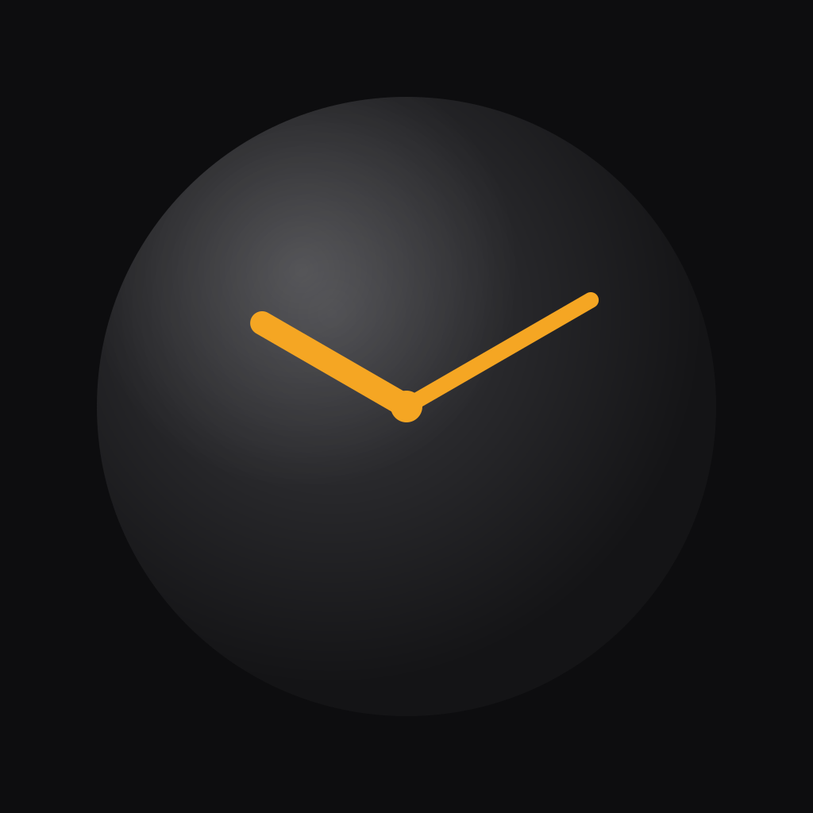

# Go Clock

A mobile chess clock designed for Go, built with React Native and Expo.



## Features

- **Four time control systems** — Byoyomi, Canadian, Fischer, and Absolute
- **Tournament presets** — filtered by mode, based on real Go tournament usage (OGS, EGF, AGA)
- **Two-player layout** — each player has their own half of the screen; the Black player's side is rotated 180° so both players can read the clock face-to-face
- **Opponent time at a glance** — a compact time strip is displayed at the edge of each player's zone, oriented toward the opponent
- **Haptic feedback** — medium impact on each clock press, escalating vibrations during the last 5 seconds of a Byoyomi period, error notification on timeout
- **Sound alerts** — beeps on the last 10 seconds of a critical period, urgent beeps on the last 5
- **Move counter** — tracks each player's move count throughout the game
- **Configurable first player** — toggle between Black and White for handicap games
- **Persistent settings** — last configuration is restored when you return to setup
- **Screen stays on** — display never sleeps during a game
- **Five languages** — French, English, Korean, Japanese, Chinese

## Time control systems

| System | Description |
|--------|-------------|
| **Byoyomi** | Main time + N periods of X seconds. Playing within a period resets it. Standard in Japanese tournaments. |
| **Canadian** | Main time + Y moves to complete within X minutes. Period resets after all moves are played. |
| **Fischer** | Each move adds an increment to remaining time. |
| **Absolute** | Fixed total time, no overtime — sudden death. |

## Presets

| Mode | Presets |
|------|---------|
| Byoyomi | Blitz (5min+5×30s), Online (10min+5×30s), Club (30min+5×30s), EGF (45min+3×30s), Long (60min+5×60s) |
| Canadian | Rapid (20min+20/5min), Standard (30min+25/10min), Long (45min+30/10min) |
| Fischer | Blitz (5min+5s), Rapid (15min+10s), Standard (30min+15s), Long (60min+30s) |
| Absolute | Blitz (10min), Rapid (20min), Standard (30min), Long (60min) |

## Getting started

```bash
npm install
npm start        # Expo dev server (scan QR code)
npm run android  # Android emulator
```

Requires the [Expo Go](https://expo.dev/go) app on your device, or a configured Android emulator.

## How to play

1. Select a time control or pick a preset on the setup screen
2. Choose which player goes first (Black by default)
3. Tap **Start game**
4. Tap the full-screen overlay to begin — each subsequent tap ends your move and starts the opponent's clock
5. Tap the **opponent's half** to pause; tap anywhere to resume
6. Use the center bar to pause ⏸, reset ↺, or go back ←

## Build & publish (Android)

### First time

```bash
npm install -g eas-cli
eas login    # create an Expo account if needed
eas init     # links the project to your Expo account
```

### Test build (APK, install directly on device)

```bash
eas build --platform android --profile preview
```

### Production build (AAB for Play Store)

```bash
eas build --platform android --profile production
```

Builds run on Expo servers (~10–15 min). The `autoIncrement` option in `eas.json` bumps `versionCode` automatically.

### Submit to Play Console

Place your Google service account JSON at the root as `google-service-account.json` (already in `.gitignore`), then:

```bash
eas submit --platform android --profile production
```

### EAS profiles

| Profile | Usage |
|---------|-------|
| `development` | Dev client with hot reload |
| `preview` | APK for direct install and testing |
| `production` | Signed AAB for the Play Store, auto-increments versionCode |
